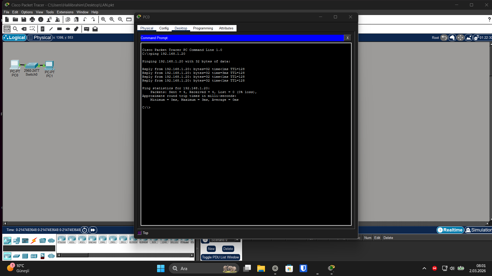

# Basic LAN Configuration Lab

日本語版はこちら → [README_jp.md](README_jp.md)

## Overview
Implemented a basic Layer 2 LAN topology using Cisco Packet Tracer.

## Topology
- 2 End Devices (PC0, PC1)
- 1 Cisco 2960 Switch
- Copper Straight-Through connections

## IP Addressing
PC0: 192.168.1.10 /24  
PC1: 192.168.1.20 /24  

## Verification
Successful ICMP echo test between hosts (0% packet loss).

## Screenshot

## Skills Demonstrated
- Basic LAN design
- Static IPv4 configuration
- Connectivity troubleshooting
- Packet-level verification

## Lab File Download

You can download the original Packet Tracer lab file below:

[Download Packet Tracer Lab File](two-lan-routing-lab.pkt)

Tested on Cisco Packet Tracer 

## License
Apache License 2.0
